# Space2Corps Actuator Control System

[](https://github.com/your-repo/Space2Corps)
[](LICENSE)
[](https://docs.espressif.com/projects/esp-idf/)

**Comprehensive CubeSat Actuator Control and Mission Management System**

## 🚀 Project Overview

The Space2Corps Actuator Control System is a sophisticated embedded solution designed for CubeSat missions, providing precise control over deployment mechanisms and comprehensive system status management throughout the mission lifecycle.

### 🎯 Mission Objectives
- **Reliable Deployment**: Ensure fail-safe operation of mechanical systems in space
- **Real-time Monitoring**: Continuous system status and sensor data tracking
- **Remote Control**: Wireless command and telemetry capabilities
- **Fault Tolerance**: Robust error detection and recovery mechanisms

### ✨ Key Features

| Feature | Description |
|---------|-------------|
| **Precision Actuation** | PWM-controlled servo (0-180°) and stepper motor (1/8 microstepping) |
| **State Machine** | 20-state finite state machine for mission phase management |
| **Sensor Integration** | LSM6DSOX IMU (accel/gyro) and GPS module support |
| **Wireless Control** | WiFi AP mode with UDP command interface |
| **Multi-tasking** | FreeRTOS-based concurrent operations |
| **Hardware Protection** | Limit switch detection and safe state transitions |

## 📦 Hardware Requirements

### 🔧 Bill of Materials

| Component | Specification | Quantity |
|-----------|---------------|----------|
| ESP32-C6 DevKitC-1 | Dual-core RISC-V | 1 |
| Servo Motor | 4.8V-6V, 180° rotation | 1 |
| Stepper Motor | NEMA 17 compatible | 1 |
| DRV8825 Driver | Stepper motor driver | 1 |
| LSM6DSOX | 6-axis IMU | 1 |
| GPS Module | UBlox NEO-6M or similar | 1 |
| Limit Switch | Normally-open | 1 |
| Power Supply | 5V/6V dual output | 1 |

### 🔌 Pin Connection Diagram

```
ESP32-C6                    Peripherals
┌────────────┐              ┌─────────────────┐
│            │              │                 │
│ GPIO 18    ├──PWM───────► Servo Signal      │
│ GPIO 19    ├──Input──────┤ Limit Switch     │
│ GPIO 20    ├──Output─────► Stepper Enable    │
│ GPIO 21    ├──Output─────► Stepper Direction │
│ GPIO 22    ├──Output─────► Stepper Step      │
│ GPIO 6-7   ├──I2C────────► LSM6DSOX         │
│ GPIO 15-23 ├──UART───────► GPS Module       │
│ 5V          ├──Power──────► Servo Power      │
│ 3.3V        ├──Power──────► Sensors          │
│ GND         ├──Ground─────► All Components   │
└────────────┘              └─────────────────┘
```

## 🚀 Getting Started

### 📥 Installation

#### Prerequisites
- PlatformIO installed
- ESP-IDF v5.5.0
- Git

#### Setup Instructions

```bash
# Clone the repository
git clone https://github.com/your-repo/Space2Corps-Actuator.git
cd Space2Corps-Actuator

# Install dependencies
pio pkg install

# Configure the project
pio run -t menuconfig
```

### 🔧 Configuration

Edit `platformio.ini` for your specific hardware:

```ini
[env:esp32-c6-devkitc-1]
platform = espressif32
board = esp32-c6-devkitc-1
framework = espidf
monitor_speed = 115200
build_flags = -D CONFIG_ESP_TASK_WDT_TIMEOUT_S=5
```

### 🚀 Building and Flashing

```bash
# Build the project
pio run

# Flash to device
pio run -t upload

# Monitor serial output
pio device monitor
```

## 🎛️ Usage

### 📡 WiFi Communication

1. **Connect to Access Point**
   - SSID: `ESP32-C6_AP`
   - Password: `password123`
   - Port: `3333` (UDP)

2. **Available Commands**

| Command | Description | Example Response |
|---------|-------------|------------------|
| `STATUS` | Query current mission status | `SYSTEM_CHECKOUT` |
| `OPEN_HINGE` | Open deployment hinge | `ACK` |
| `CLOSE_HINGE` | Close deployment hinge | `ACK` |
| `STANDBY` | Enter low-power mode | `ACK` |

3. **Command Examples**

```bash
# Using netcat
echo "STATUS" | nc -u 192.168.4.1 3333

# Using Python
python3 -c "import socket; s=socket.socket(socket.AF_INET, socket.SOCK_DGRAM); s.sendto(b'OPEN_HINGE', ('192.168.4.1', 3333)); print(s.recv(100))"
```

### 📊 Serial Monitoring

The system provides comprehensive logging via serial interface:

```
[MASTER_STATUS] Current Status: MAGENTASystem CheckoutRESET
[MASTER_ACTUATOR] Position at 0° Duty = 1638
[MASTER_SENSORS] Accel: X=0.02 g Y=-0.01 g Z=0.98 g | Gyro: X=0.12 dps Y=-0.05 dps Z=1.23 dps
[MASTER_SENSORS] GPS: Lat=48.8566° Lon=2.3522° Alt=120.5m Sat=8 HDOP=1.2
```

### 🎚️ Manual Control

For testing and calibration:

1. **Servo Control**: Adjust `HINGE_OPEN` and `HINGE_CLOSE` values in `actuator.h`
2. **Stepper Calibration**: Modify `STEPS_PER_REVOLUTION` for precise positioning
3. **Limit Switch**: Adjust positioning for reliable detection

## 📂 Project Structure

```
.
├── include/               # Header files
│   ├── actuator.h         # Actuator control interfaces
│   ├── main.h             # Main definitions and structures
│   ├── status.h           # State machine definitions
│   ├── sensors.h          # Sensor interfaces
│   └── wifi.h             # WiFi communication
├── src/                   # Source files
│   ├── actuator.c         # Actuator implementations
│   ├── main.c             # Main application logic
│   ├── status.c           # State machine logic
│   ├── sensors.c          # Sensor drivers
│   └── wifi.c             # WiFi implementation
├── DOC.md                 # Complete technical documentation
├── platformio.ini         # Build configuration
└── README.md              # This file
```

## 🔧 Development

### 🛠️ Building Blocks

#### State Machine
- 20 distinct mission states
- Sequential progression with validation
- Color-coded status display
- Comprehensive transition logging

#### Actuator Control
- **Servo**: 50Hz PWM, 0-180° range
- **Stepper**: 1/8 microstepping, 1600 steps/rev
- **Safety**: Limit switch detection
- **Power Management**: Motor enable control

#### Sensor Integration
- **IMU**: LSM6DSOX via I2C (100kHz)
  - Accelerometer: ±2g, 1660Hz ODR
  - Gyroscope: ±2000dps, 1660Hz ODR
- **GPS**: NMEA 0183 via UART (9600 baud)
  - Position, velocity, time data
  - Checksum validation

### 🧪 Testing

#### Unit Testing
```bash
# Run specific tests
pio test -f test_actuators
pio test -f test_state_machine
```

#### Integration Testing
1. Verify all state transitions
2. Test sensor data fusion
3. Validate command protocol
4. Check error recovery

### 📝 Coding Standards

- **Naming**: `snake_case` for variables/functions, `PascalCase` for types
- **Documentation**: Doxygen-style comments for all public functions
- **Error Handling**: Comprehensive error checking and logging
- **Memory**: Static allocation where possible, dynamic with validation

## 📖 Documentation

Complete technical documentation is available in [DOC.md](DOC.md):

- ✅ System Architecture
- ✅ State Machine Diagram
- ✅ Hardware Interface Specifications
- ✅ Software Module API Reference
- ✅ Communication Protocol
- ✅ Development Guidelines
- ✅ Deployment Procedures
- ✅ Troubleshooting Guide
- ✅ Future Enhancements Roadmap

## 🚀 Mission Sequence

### 📅 Typical Mission Timeline

```mermaid
gantt
    title Space2Corps Mission Timeline
    dateFormat  HH:mm
    axisFormat %H:%M

    section Ground
    FLOOR                   :a1, 00:00, 30m
    SYSTEM_CHECKOUT         :a2, after a1, 15m

    section Launch
    ASCENT                 :a3, after a2, 10m
    SEPARATION              :a4, after a3, 5m

    section Deployment
    COIL_WINDING           :a5, after a4, 2m
    OPEN_HINGE              :a6, after a5, 1m
    PROPULSION_THRUST       :a7, after a6, 3m

    section Operations
    STANDBY                :a8, after a7, 30m
    DATA_DOWNLINK          :a9, after a8, 15m

    section Completion
    END_OF_MISSION         :a10, after a9, 5m
```



### 🔄 State Transition Flow

```
[FLOOR] → [ASCENT] → [SEPARATION] → [SYSTEM_CHECKOUT]
    ↓
[COIL_WINDING] → [OPEN_HINGE] → [PROPULSION_THRUST]
    ↓
[STANDBY] → [DATA_DOWNLINK] → [END_OF_MISSION]
    ↓
[SAFE_MODE] ← [SURVIVAL] (error recovery)
```

## ⚠️ Troubleshooting

### 🚨 Common Issues

| Symptom | Possible Cause | Solution |
|---------|----------------|----------|
| No WiFi AP | WiFi stack error | Check `wifi_init_softap()` return codes |
| No sensor data | I2C/UART not initialized | Verify `init_i2c()` and `init_uart()` |
| Actuators not responding | GPIO config error | Check `init_actuator()` execution |
| Unexpected state | Invalid transition | Review `handle_misson_status()` logic |

### 🔍 Debugging Tips

1. **Enable Verbose Logging**
   ```c
   #define LOG_LOCAL_LEVEL ESP_LOG_VERBOSE
   ```

2. **Monitor State Transitions**
   ```bash
   pio device monitor | grep "MASTER_STATUS"
   ```

3. **Check Hardware Connections**
   - Verify all voltages (3.3V, 5V, 6V)
   - Test continuity of all connections
   - Check I2C pull-up resistors (4.7kΩ)

## 🎓 Learning Resources

### 📚 Documentation
- [ESP32-C6 Technical Reference](https://www.espressif.com/en/products/socs/esp32-c6)
- [ESP-IDF Programming Guide](https://docs.espressif.com/projects/esp-idf/)
- [FreeRTOS API Reference](https://www.freertos.org/a00106.html)

### 🎥 Tutorials
- [ESP32 WiFi Configuration](https://youtu.be/...)
- [FreeRTOS Task Management](https://youtu.be/...)
- [LSM6DSOX Sensor Guide](https://youtu.be/...)

## 🤝 Contributing

We welcome contributions! Please follow these steps:

1. **Fork the repository**
2. **Create a feature branch**
   ```bash
   git checkout -b feature/your-feature
   ```
3. **Commit your changes**
   ```bash
   git commit -m "Add your feature"
   ```
4. **Push to the branch**
   ```bash
   git push origin feature/your-feature
   ```
5. **Open a Pull Request**

### 📝 Contribution Guidelines

- Follow existing code style
- Add comprehensive tests
- Update documentation
- Keep commits focused
- Write clear commit messages

## 📜 License

This project is licensed under the MIT License - see the [LICENSE](LICENSE) file for details.

## 🙏 Acknowledgments

- Espressif Systems for ESP32-C6
- FreeRTOS community
- STMicroelectronics for LSM6DSOX
- All contributors and testers

---

**Space2Corps Actuator Control System**
*Building the future of CubeSat deployment systems*

📧 Contact: your-email@example.com
🌐 Website: https://space2corps.example.com
🐙 GitHub: https://github.com/your-repo/Space2Corps

*Documentation generated by Mistral Vibe* 🚀
